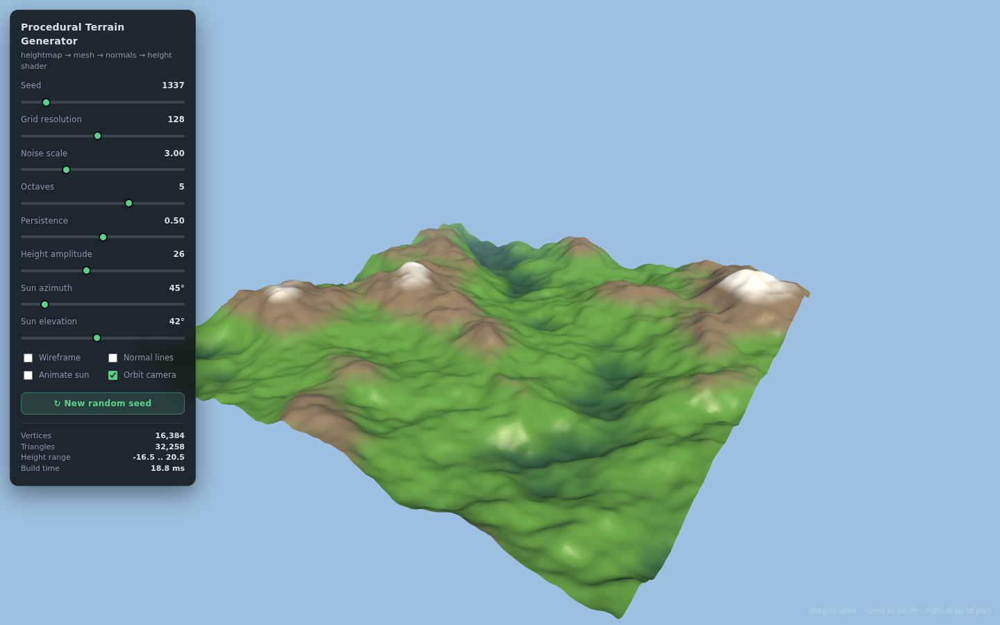

# Procedural 3D Terrain Mesh Generator & Shader

A from-scratch heightmap-to-mesh terrain renderer built with **Three.js + a hand-written GLSL shader**.
No terrain engine, no `computeVertexNormals()`, no baked textures — every vertex, UV, index, normal and
colour is produced by code you can read top to bottom.



---

## Run it

```bash
npm start          # python3 -m http.server 8080
# open http://localhost:8080
```

Any static file server works (`npx serve`, `php -S`, nginx…). The page pulls Three.js from a CDN via an
import map, so there is **no build step** — clone, serve, open.

Drag to orbit, scroll to zoom, right-drag to pan. Every slider rebuilds the mesh live (a 128×128 grid
rebuilds in ~19 ms, 256×256 in ~53 ms).

---

## Deploy (Cloudflare Workers)

The site is static — a Worker serves the same files with no bundler and no framework:

```bash
npm install
npm run dev        # copy + local Worker preview at http://localhost:8787
npm run deploy     # copy + wrangler deploy -> https://procedural-3d-terrain.<subdomain>.workers.dev
```

Both scripts run `npm run build` first: a plain copy of `index.html`, `src/` and `docs/` into
`dist/` (gitignored, ~15 files — the repo itself still serves straight from `npm start` with no
build step). `wrangler.jsonc` points the Worker at `dist/` rather than the repo root, because
`wrangler dev` watches its asset directory and Wrangler rewrites `.wrangler/` state continuously —
watching the root puts dev into an infinite reload loop.

The first deploy authenticates interactively (`npx wrangler login`) or headlessly via a
`CLOUDFLARE_API_TOKEN` with "Workers Scripts: Edit" + "Workers Routes: Edit" permissions.

---

## Acceptance criteria

| Requirement | Where it lives |
| --- | --- |
| Mesh generated programmatically (no built-in terrain tools) | `src/terrain.js` — positions, UVs and indices written by hand into `BufferGeometry` |
| Normals correctly calculated for directional lighting | `src/terrain.js` → `computeVertexNormals()` — per-face cross products, area-weighted accumulation |
| Terrain dynamically coloured/shaded by height (Y-axis) | `src/shaders.js` → fragment shader height ramp + slope mask |
| Verbal walkthrough of the math | Loom script at the bottom of this file + `window.__APP` debug handle |

---

## How it works

### 1. The heightmap (2D noise array)

`src/noise.js` builds an `N × N` `Float32Array` of heights. Each sample is fractional Brownian motion
(fBm) over seeded Perlin noise — octaves stacked at `lacunarity`× frequency and `persistence`× amplitude:

```
h(u, v) = Σ₀ⁿ⁻¹  persistenceᵒ · noise(u · scale · lacunarityᵒ, v · scale · lacunarityᵒ)
          ─────────────────────────────────────────────────────────────────────────────────
                              Σ₀ⁿ⁻¹  persistenceᵒ
```

Normalising by the total amplitude keeps the result in ~[-1, 1] no matter how many octaves are used,
and a mulberry32 PRNG seeds the permutation table so the same seed always yields the same mountain.
The field is stored on the unit square, so `noiseScale` is independent of resolution.

### 2. Vertices, UVs and triangles

`buildGrid()` walks the heightmap once and writes the arrays directly (grid vertex `(i, j)` → index
`j·N + i`):

```
x = (i / (N-1) - 0.5) · size        u = i / (N-1)
y = heightmap[j·N + i]              v = j / (N-1)
z = (j / (N-1) - 0.5) · size
```

Each quad becomes two triangles wound counter-clockwise when seen from +Y, so every face initially
points at the sky and the mesh is front-facing from a normal camera:

```
b --- d        a = (i,   j  )     tris:  (a, b, c)  and  (c, b, d)
| \   |        b = (i,   j+1)
|  \  |        c = (i+1, j  )
a --- c        d = (i+1, j+1)
```

Result: `N²` vertices and `2·(N-1)²` triangles (128² → 16,384 verts / 32,258 tris).

### 3. Normals

One unit normal per vertex, computed by hand:

```
for each triangle:
    e1 = v1 - v0
    e2 = v2 - v0
    faceNormal = e1 × e2                    // right-hand rule, |faceNormal| = 2 × area
    accumulate faceNormal into v0, v1, v2   // area weighting: big triangles count more

vertexNormal = normalize( Σ faceNormal )    // shared indices average across every touching face
```

Because the index buffer shares vertices between neighbouring quads, the accumulation is exactly the
smooth-shaded normal directional lighting needs — flat ground reads `N ≈ (0,1,0)`, a 45° slope reads
`N ≈ (0.7, 0.7, 0)`.

**Validation:** `tests/normals.test.mjs` compares the computed normals against the analytic normal of
the height field from central differences, `normalize(-∂h/∂x, 1, -∂h/∂z)`, across four seed/resolution
combinations: the mean dot product must exceed **0.99** everywhere (it lands at **0.9987** for the
default 128² grid, worst vertex 0.976 over 15,876 interior vertices). The "Normal lines" checkbox
draws every normal so you can see them splay outward on ridges.

### 4. The height shader (the filter)

`src/shaders.js`, plain GLSL:

1. **Normalise Y** → `t = clamp((worldY - minHeight) / (maxHeight - minHeight), 0, 1)`, so colouring
   is independent of amplitude and resolution.
2. **Colour ramp** on `t`: dark valley green → grass → rock → snow, blended with `smoothstep`.
3. **Slope mask**: `slope = 1 - N.y` forces steep faces to exposed rock regardless of altitude.
4. **Lambert diffuse**: `max(dot(N, sunDir), 0)` — this is what makes slopes and valleys readable.
5. **Blinn-Phong specular**: half-vector `H = (sunDir + viewDir) / max(|sunDir + viewDir|, ε)`, `pow(dot(N,H), shininess)`.
6. Sky-tinted ambient (upward normals catch more light), distance fog, then `pow(color, 1/2.2)`
   gamma encoding.

Colour is a function of world-space Y evaluated per fragment, so it updates the instant the heightmap
regenerates — no texture to repaint, no vertex colours to rebake.

---

## Controls

| Control | What it changes |
| --- | --- |
| Seed | New permutation table → a different mountain |
| Grid resolution | `N` in `N × N` vertex grid (16 → 256) |
| Noise scale / octaves / persistence | fBm frequency, detail octaves, falloff |
| Height amplitude | World-space Y multiplier |
| Sun azimuth / elevation | Sun direction fed to the shader |
| Wireframe | Shows the generated triangle topology |
| Normal lines | Draws every computed vertex normal |
| Animate sun | Orbits the sun so lighting sweeps across the slopes |
| New random seed | Re-rolls and rebuilds |

`window.__APP` exposes `{ renderer, scene, camera, material, terrain, params, rebuild }` for poking
around in the console while recording.

---

## Tests

```bash
npm install
npm test          # 314 checks across 10 files, ~35 s
```

The suite is split between pure-Node tests for the math and headless-Chromium tests for the renderer:

| File | Covers |
| --- | --- |
| `tests/noise.test.mjs` | PRNG determinism/uniformity, Perlin lattice + continuity + bounds, fBm normalisation, octave detail, heightfield scaling |
| `tests/noise-properties.test.mjs` | 256-periodic lattice, degenerate fBm inputs (0/negative/NaN octaves, zero frequency), hostile persistence, heightfield guards, seed/octave/scale sweeps, randomised fuzz |
| `tests/geometry.test.mjs` | vertex/triangle counts, index bounds, watertight quad sharing, Y-from-heightmap, XZ bounds, UV ranges/monotonicity, degenerate triangles |
| `tests/geometry-properties.test.mjs` | edge multiplicities + boundary-edge counts, quad corner layout, resolution sweep (2…64), index storage, `buildGrid` validation, normal quality (adjacent dots, second-order convergence, triangle-order invariance), degenerate inputs, fuzz |
| `tests/normals.test.mjs` | unit length, closed-form planes, Gaussian peak orientation, mirror symmetry, translation invariance, **analytic central-difference comparison** |
| `tests/shader-units.test.mjs` | material/uniform construction, GLSL source contract, `setSunAngles` math |
| `tests/source.test.mjs` | anti-cheat: no built-in terrain/plane helpers, hand-written attributes and cross products, project contract |
| `tests/acceptance.test.mjs` | the bounty rubric written out as checks: programmatic mesh, correct normals, Y-driven colouring, documented maths, runnable repo |
| `tests/shader-browser.test.mjs` | real GLSL compile + link, height→uniform plumbing, framebuffer probes for the colour ramp (six stops), slope mask, `dot(N, L)`, specular half-vector, height-range remapping, distance fog |
| `tests/render.test.mjs` | UI wiring, live regeneration at every resolution, build budgets, slider extremes, determinism, lighting vs framebuffer luminance, toggles, mesh integrity (UV/normal/bbox), `gl.getError`, geometry disposal, resize, pixel output |

The headless tests boot a static server and a cached Chromium (set `CHROME_PATH` if yours lives elsewhere), read pixels straight out of the WebGL framebuffer, and drop a screenshot in `/tmp/opencode/terrain-suite.png`.

---

## Project layout

```
index.html          import map, control panel
src/noise.js        seeded Perlin + fBm → 2D heightmap
src/terrain.js      heightmap → positions / UVs / indices / normals
src/shaders.js      custom vertex + fragment shader (height colouring, lighting)
src/main.js         scene, camera, UI wiring, rebuild loop
tests/*.test.mjs    math + headless render checks (npm test)
```

---

## Loom script (≈2 min)

1. **0:00 — What this is.** "Procedural terrain: a 2D noise array becomes a 3D mesh, then gets coloured
   by height. No Unity terrain, no built-in helpers."
2. **0:15 — The heightmap.** Show `noise.js`. "Seeded Perlin noise, five octaves of fBm, each octave
   higher frequency and lower amplitude, summed and normalised — that gives me an N×N array of
   heights in world units."
3. **0:40 — Mesh generation.** Show `terrain.js` `buildGrid`. "I loop the array and write position,
   UV and index buffers by hand: X and Z from the grid indices scaled to world size, Y straight from
   the height array. Two CCW triangles per quad, so faces point up. 128×128 → 16,384 vertices."
4. **1:05 — Normals.** Point at the Normal lines toggle. "For every triangle I take `e1 × e2`, which
   gives a face normal whose length equals twice the triangle area, accumulate it into all three
   corners, then normalise. That area-weights the average across shared vertices. Verified against the
   analytic `normalize(-dh/dx, 1, -dh/dz)` — mean dot 0.9987."
5. **1:35 — The shader.** Show `shaders.js`. "Fragment shader: I normalise world Y into 0-to-1, ramp
   the colour valley→grass→rock→snow with smoothsteps, force steep slopes to rock using `1 - N.y`,
   then light it — Lambert `dot(N, sun)` for the diffuse term, Blinn-Phong half-vector for specular,
   plus ambient, fog and gamma."
6. **1:55 — Live demo.** Drag amplitude and seed, toggle wireframe and normals, sweep the sun.
   "Everything rebuilds in about 20 milliseconds and the colours follow the new heights immediately."
7. **2:10 — Wrap.** "All the math is in `terrain.js` and `shaders.js`, and `npm test` runs 314
   automated checks, including the normal comparison against the analytic derivative."

---

MIT
